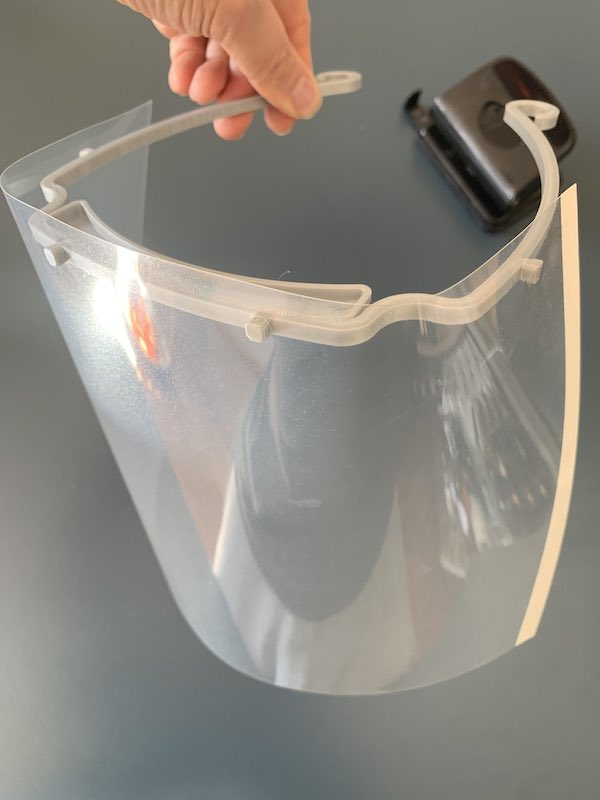
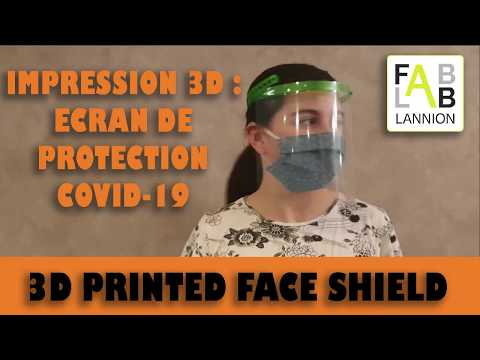

# Guide d'impression des visières imprimées par le FabLab de Lannion
(par Frédérique Pinson, Philippe Charlot, Frédéric Carré et 3dverkstan, 3d.freerider-factory)

Nous imprimons à l'heure actuelle 2 modèles : 
* [**Modèle 1**](#Modele1) imprimable en PLA et autres matériaux,
* [**Modèle 2**](#Modele2) imprimable en PET, PETG mais ne nécessitant pas d'élastiques.

## **Modèle 1, imprimable en PLA** 

### Source:  ([https://3dverkstan.se/protective-visor/](https://3dverkstan.se/protective-visor/)) Version Européenne.

### STL: 
sur notre repo: [Visor_frame_EUROPE_ISO838_v3.stl](Visor_frame_EUROPE_ISO838_v3.stl)
repo d'origine: [https://www.youmagine.com/designs/protective-visor-by-3dverkstan](https://www.youmagine.com/designs/protective-visor-by-3dverkstan)
mirror : [https://github.com/Cederb/Faceshield.nu/](https://github.com/Cederb/Faceshield.nu/)

Ce modèle est imprimable en PLA mais si vous avez du PET ou de l'ASA,  par exemple, ce serait mieux.
Voir plus bas la doc d'impression et de montage traduite sur [https://3d.freerider-factory.fr](3d.freerider-factory), dont nous reproduisons des extraits

### Réglages Cura que nous utilisons au Fablab: 

Buse de l'imprimante : 0.4 mm
Tranchage : Slic3r

Layer height : 0.2 mm

First layer height : 0.3 mm

Solid layers : Top 3, bottom 3

Density : 40 %

Pattern : Honeycomb

Top/bottom fill pattern : Rectilinear

Brim : 1 mm

Support : no

Speed perimeters : 30 mm/s 

Speed infill : 60 mm/s

Diametre PLA : 1.75 mm

Temperature extruder : 190 °C

Temparature Bed : 60 °C

Retractation : 4 mm

Retractation speed : 30 mm/s

## Guide d'impression  
--merci [https://3d.freerider-factory.fr]() pour la traduction de la doc d'origine ---

Ceci est un guide sur la façon de choisir vos paramètres d'impression et d'imprimer les visières de protection / écrans faciaux.
 
Les paramètres décrits ci-dessous sont décrits avec la terminologie utilisée dans Ultimaker Cura, mais ils devraient pouvoir entrer dans n'importe quel logiciel du marché qui vous permet de modifier les paramètres de vos imprimantes.

## QUEL FILAMENT DOIS-JE UTILISER ?
Jusqu'à présent, tous les plastiques rigides les plus couramment utilisés dans l'impression 3D à base de filaments se sont avérés prometteurs pour bien fonctionner.
**Si vous achetez du filament spécialement pour ce projet, optez pour le PETG ou un autre polyester, ceux-ci ont une meilleure résistance à la température et une tolérance légèrement meilleure à certains produits chimiques, mais si le PLA est tout ce que vous avez, allez-y !
**
### Les filaments que vous ne devez PAS utiliser sont:
Tout ce qui est flexible, TPU, TPC ou similaire.
Tout ce qui est poreux, comme Polymatte ou Colorfabb LW-PLA
Bois ou autres polymères remplis de fibres naturelles, ceux-ci peuvent absorber les fluides.
PVB, PVA ou BVOH, tout ce qui est facilement soluble dans l'alcool ou l'eau, PolySmooth n'est pas un filament approprié à utiliser pour les fabriquer car il se dissoudra dans la désinfection que l'hôpital utilisera.
PMMA, car il a une très faible résistance aux alcools.
Nous n'avons pas évalué l'utilisation d'imprimantes en résine pour imprimer des cadres d'écran facial.

### QUEL POURCENTAGE DE REMPLISSAGE DOIS-JE UTILISER ?
Ce modèle est fait pour être imprimer sans remplissage. Mais il est également conçu pour être imprimé entièrement solide.
Cela signifie que vous pouvez définir votre pourcentage de remplissage à 0%, tant que vous suivez les paramètres de largeur de ligne suggérés ci-dessous. Cela rendra votre impression plus solide et plus rapide à imprimer.

Il est important que l'impression ait le moins de vides possible, car cela augmentera le temps de séchage à chaque fois qu'elle est trempée dans une solution désinfectante et la rendra plus difficile à nettoyer.

### QUELLE TAILLE / LIGNE DE BUSE DOIS-JE UTILISER ?
Étant donné que l'un des éléments clés de ce projet est d'obtenir un volume de production élevé, si vous en avez la possibilité, nous vous suggérons d'utiliser une buse plus grande que standard et une hauteur de couche plus grande que celle à laquelle vous êtes habitué.

Les pièces sont entièrement imprimables avec des buses jusqu'à 1,2 mm si vous choisissez les paramètres appropriés.

Ce que vous devez faire est de définir toutes vos largeurs de ligne sur un multiple d'environ 4 mm.
Sachez que Cura cache un certain nombre de paramètres, alors réglez la visibilité des paramètres sur "expert".

Définissez une épaisseur de parois égale à ~ 2,5 mm. Avec une largeur de ligne de 0,8 mm, vous devez avoir au moins 3 épaisseurs de paroi, avec 0,4 mm, elle devrait être d'au moins 5, et avec une largeur de ligne de 1,33 mm, seulement 2 murs sont nécessaires.

Cela signifie que la largeur de ligne optimale est :

* Buse de 0,4 mm -> Définir la largeur de ligne à 0,5 mm
* Buse de 0,6 mm -> Définir la largeur de ligne à 0,66 ou 0,8 mm
* Buse de 0,8 mm -> Régler la largeur de ligne à 0,8 mm ou 1,0 mm
* Buse de 1,0 mm -> Définir la largeur de ligne à 1,0 mm
* Buse de 1,2 mm -> Définir la largeur de ligne à 1,33 mm

### QUELLE HAUTEUR DE COUCHE DOIS-JE UTILISER ?
Le design est très compatible avec les couches épaisses sans effets négatifs, donc la réponse est "aussi épaisse que possible".

Le principal facteur limitant sera la taille de votre buse, car les couches nécessitent un peu de compression, par défaut, cela vous limite à environ 2/3 ou 66% de votre taille de buse en mm en tant qu'épaisseur de couche.

Vous devez garder la hauteur de votre couche à 0,6 mm ou moins, sinon la fine zone de protection contre les gouttes au-dessus des yeux ne s'imprimera pas.

### Les hauteurs de couche que nous suggérons d'utiliser sont:
* 0,4 mm: 0,25 mm (standard)
* 0,6 mm: 0,3 mm (standard)
* 0,8 mm: 0,3 mm (standard)
* 0,8 mm: 0,5 mm (à haut débit)
* 1,0 mm: 0,6 mm (à haut débit)
* 1,2 mm: 0,6 mm (à haut débit)

### QUELLE VITESSE D'IMPRESSION DOIS-JE UTILISER ?
Étant donné que cette conception n'a pas de surplombs réels et peu de besoin de refroidissement, le principal facteur limitant la vitesse à laquelle vous pouvez pousser ces cadres sera votre débit de pointe.

Le débit de pointe est le nombre qui détermine la quantité de plastique que votre imprimante peut fondre dans un certain laps de temps.

Commencez avec l'épaisseur de couche et la largeur de ligne suggérées pour la buse que vous utilisez, et une vitesse d'impression de 40 mm / sec. Cela devrait fonctionner sur presque toutes les imprimantes.

Assurez-vous de définir tous les différents paramètres de vitesse d'impression sur le même nombre, cette conception répond très bien à cela.

Ultimaker Cura possède un certain nombre de paramètres de vitesse d'impression "masqués", mais si vous activez le mode "expert", vous pouvez tous les définir.

La seule qui devrait être inférieure est la "vitesse d'impression de la couche initiale", car elle est importante pour l'adhérence du lit. Une bonne valeur de départ est d'environ 20 mm / sec.

## **Modèle 2, imprimable en PET, PETG** 

Modèle conçu par Fred C. du Fablab pour éviter d'avoir à utiliser des élastiques.
Il faut impérativement du matériau souple (PET, PETG).

STL: [https://www.thingiverse.com/thing:4239230/files](https://www.thingiverse.com/thing:4239230/files)

Présentation et mode de montage:  [https://youtu.be/Dc9mKZUixy8](https://youtu.be/Dc9mKZUixy8)
