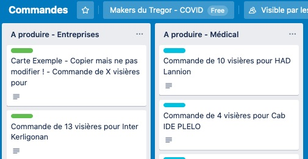
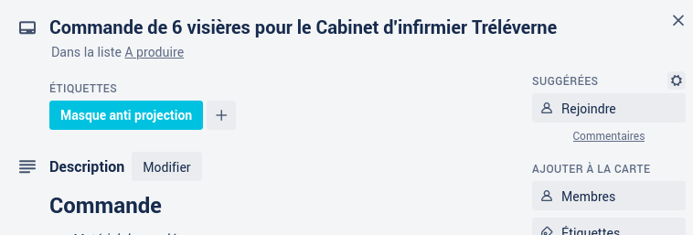
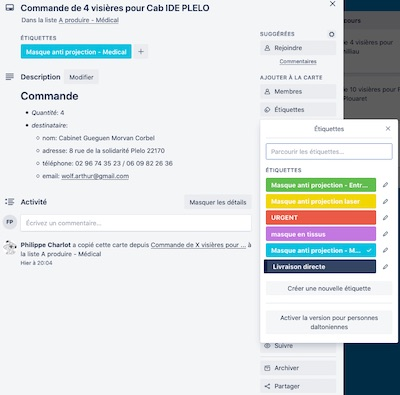

Pour les makers:
================

Si vous êtes en possession d'une imprimante 3D ou d'une machine à coudre,
et que vous souhaitez rejoindre la communauté des makers du trégor contre le Covid19,
 merci de lire tout d'abord ces quelques lignes.

- Tout d'abord MERCI à vous :) C'est le meilleur moment pour montrer
  l'utilité des outils de production locaux et de montrer à quoi
  ils servent au quotidien.
- La production est libre, sous couvert du bénévolat, donc faites
  en fonction de vos moyens et disponibilités.
- Le Fablab gère la coordination de la partie "production" et nos partenaires la partie
  prise de commande, collecte et distribution.
  Ce sont donc eux qui passeront chercher vos réalisations chez vous et les distribueront.
- La production n'est pas rémunérée ou dédommagée (il y aura certainement un
  gros apéro à la fin :))
- La coordination est bénévole, veuillez nous pardonner si on ne répond pas
  assez vite. 
  
Fabriquez suivant les conseils ci-dessous et nous vous contacterons dès que possible.
  
###   Ce qu'on vous demande d'imprimer: ([infos sur les modèles 3D](modeles3DCovid.md))
-  Pour ceux qui ont une imprimante avec un plateau de mini 200x200: 
   - des serre-têtes pour visières de protection, (nos partenaires s'occupent de perforer les feuilles transparentes pour les visières et de les livrer montées)

-  Pour ceux qui ont une imprimante avec un plateau plus petit, nous sommes en train de tester un modèle plus petit. Dès qu'il est validé, nous pourrons vous le proposer.

###  Ce que l'on vous conseille de coudre:
   - A venir...

Etape 1: prise de contact
-----------

Vous pouvez nous contacter aux adresses suivantes:
 - Impressions 3D: [covid@fablab-lannion.org](mailto://covid@fablab-lannion.org)
 - Masques tissus: [covid-tissus@fablab-lannion.org](mailto://covid-tissus@fablab-lannion.org)

Précisez ce que vous pouvez faire et vos besoins.

Un coordinateur ou une coordinatrice vous répondra en vous demandant par mail :
-  vos coordonnées (nom, adresse, téléphone) pour la collecte des objets produits
-  un compte sur [Trello](https://trello.com),  qui nous sert à gérer les demandes.

  Merci de créer un compte avec un nom lisible (ie: pas un pseudonyme).
  C'est plus facile pour faire le lien entre le maker et son adresse :)
  
 
Etape 2: inscription
------------

Nous vous ajoutons:

- à notre tableau Trello sur lequel nous listons les commandes à réaliser.
- au fichier (privé) listant les makers.

Nous avons des collecteurs/collectrices en charge d'une zone géographique définie. 
Vous aurez donc un/une collecteur/collectrice attribué. 
Celui-ci ou celle-ci vous contactera après votre inscription.
  

Etape 3: production !
------

Dans l'application Trello:

1 - Choisissez une fiche dans la colonne '**A produire - Médical**' (c'est la priorité) ou '**A produire - Entreprises**'
> en général on prend la première pour traiter les demandes dans l'ordre d'arrivée

 

 et cliquez sur la fiche pour l'ouvrir, puis sur "rejoindre".
  
  
  
  

> Rejoindre la carte, cela ajoute votre avatar ou vos initiales sur le résumé de la carte et cela nous permet de voir qui fait quoi, d'un seul coup d'oeil.
>  
> De plus, cela vous donne un aperçu sur son traitement: si vous avez mis votre adresse mail dans le coordonnées du compte Trello, 
> vous recevrez automatiquement un mail quand la carte aura été bougée vers la colonne ( "**Terminé**"). 

 2 - Passez cette fiche dans la colonne "**En cours de production**", et ... c'est parti pour imprimer ! (voir les [infos sur les modèles](modeles3DCovid.md))
 
 3 -  Dès vous avez fini de produire un lot de serre-têtes pour une carte : 
 	
 - S'il y a au moins 8-10 visières, vous pouvez bouger la carte dans "**A Récupérer chez le maker**" et envoyer un SMS à votre collecteur/collectrice. 

 - Si la carte fait moins de 8, attendez d'avoir fait une autre carte pour envoyer le SMS.

> Nous faisons cela pour éviter que les collecteurs se déplacent trop souvent, pour 2 ou 3 unités, par exemple.

4 - Dès que vous avez donné vos impressions à votre collecteur/collectrice, merci de faire bouger vos cartes dans la colonne "**Livraison en cours**".

5- GOTO 1.

> Attention : Dans le cas où vous donnez des impressions pour des entreprises -et- pour le médical, séparez les (deux pochettes plastiques) avant de les donner à votre collecteur/collectrice, ça ne va pas au même destinataire au final.

> Attention 2: Nous essayons de d'organiser au mieux cette collecte avec notre partenaire CoDeHSa, il se peut cependant que la procédure que nous avons fixé avec eux change un peu. 

<b>Nous restons à votre écoute pour répondre à vos questions ou vos remarques, N'hésitez pas !</b>
 

Etape 3 Bis : Cas d'une livraison directe
------------------------------------------
Dans le cas où vous faites de la livraison directe (par ex vous êtes loin de Lannion et il y a une demande près de chez vous).
*Cela implique que vous avez des feuilles transparentes et de quoi les perforer pour monter les visières vous-même.
Cela implique aussi que vous irez livrer vos voisins avec votre attestation, en mode "courses" ou "balade".*

Si c'est le cas: Lorsque vous ouvrez une carte (pour la "rejoindre"), ajoutez-y une étiquette "**Livraison directe**". 
Les collecteurs/trices sauront alors qu'ils n'ont pas à venir chercher ces impressions chez vous.

Lorsque vous avez fini d'imprimer, vous pouvez directement passer vous-même la case dans la colonne "**Livraison en cours**", 
puis lorsque vous aurez livré, dans la colonne "**Terminé**".

Et c'est reparti pour une nouvelle carte !

