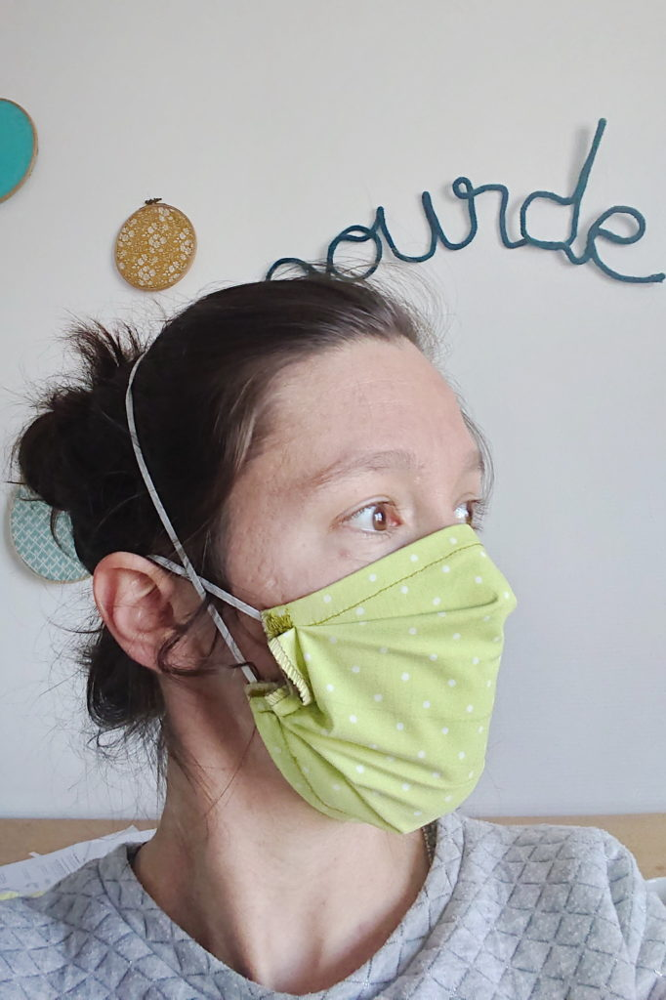

#  Ce que l'on vous conseille de coudre:

Pour la création de masque en tissu nous vous proposons de réaliser :

- le masque du CHU de Grenoble : patrons, tuto papier et couture à la surjeteuse décrits [ici](https://www.coutureconnectee.com/). Vous pouvez aussi suivre ce [tuto vidéo](https://youtu.be/mNbBBckLVFo).
- Les masques du guide de l'Afnor "à plis" ou "bec de canard" ([le guide](https://www.snof.org/sites/default/files/AFNORSpec-S76-001-MasquesBarrieres.pdf),  [les patrons](https://www.snof.org/sites/default/files/AFNORSpec-S76-001-MasquesBarrieres-AnnexeC-patrons.pdf)) . Vous pouvez suivre ce [tuto sur les masques "à plis"](https://latelierdesgourdes.fr/tuto-masque-afnor/?fbclid=IwAR2SeCGSByEmsfM_q7IaG_cCpUPm0eVDVRY_wY2_JggaVe51qSV2STNTDiA) qui est plus clair que le guide Afnor.

Les modèles peuvent être réalisés avec ou sans tissu intérieur en fonction du matériel à votre disposition.

Les élastiques peuvent être remplacés par des liens en coton ou en jersey pour plus de souplesse.

Voici ce que donne le rendu du masques proposé sur le site [https://latelierdesgourdes.fr](latelierdesgourdes.fr)

