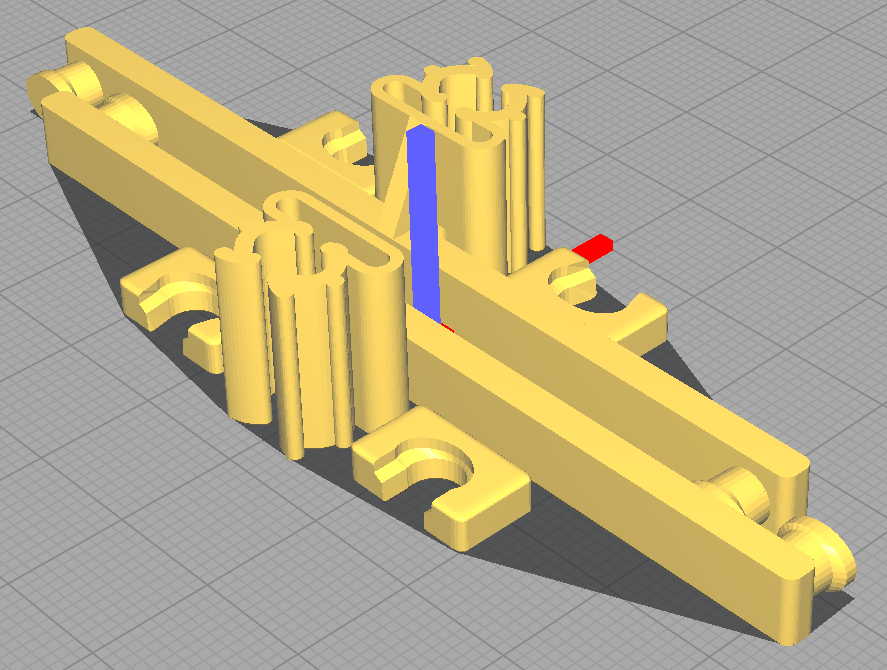

# Modèles 3D pour les petites imprimantes

## Bandeau pour les masques tissus

Sur un modèle proposé ici [https://www.thingiverse.com/thing:4249113](https://www.thingiverse.com/thing:4249113)
nous vous proposons d'imprimer [ce modèle](./strap_small.stl) qui a été réduit
pour passer sur un plateau de Micro Delta.

## Support pour les lunettes

Le modèle de support de visière peut être imprimé sur une petite imprimante.
Il est prévu pour une perforatrice 2 trous avec entraxe de 80 mm. Des ergots
de blocage sont prévu pour s'assurer que la feuille ne se déclipse pas.

Voici les modèles:
 - [support sur lunettes à branches standard](./support_lunettes.stl)
 - [support sur lunettes à larges branches (>10mm)](./support_lunettes_L.stl)
 - [support sur lunettes à fines branches (<4mm)](./support_lunettes_S.stl)
 - [clip de fixation pour support sur lunettes](./support_lunettes_clip.stl)

Les réglages utilisés jusqu'à maintenant pour ce modèle sont:
- épaisseur de couche: 3mm
- jupe: 3mm

