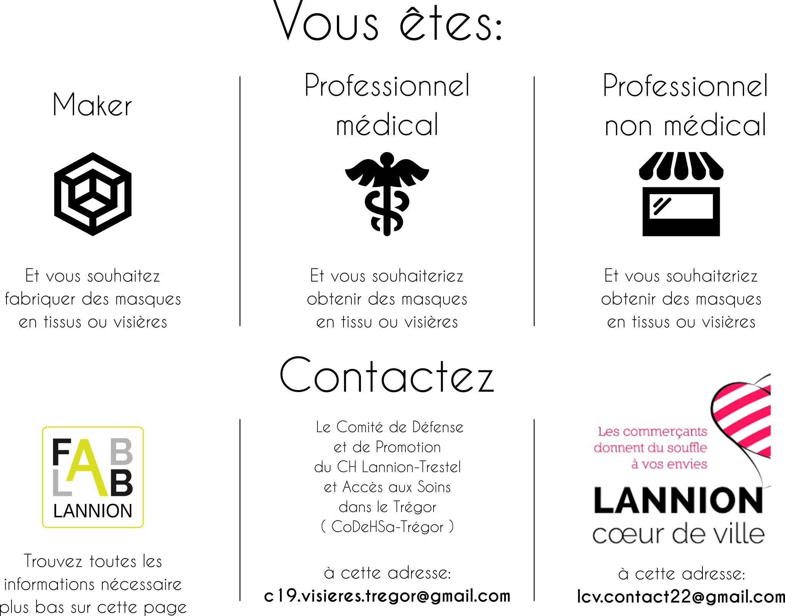

Makers du trégor contre le COVID19
==================================

<b>Pour les makers, c'est par --> [ici](./covid-makers.md)</b>

Les contacts de nos partenaires:
- Pour les professions médicales - CoDEHSa-Trégor:
  c19.visieres.tregor@gmail.com
- Pour les professions non médicales - Lannion Coeur de Ville: lcv.contact22@gmail.com

Dernière précision pour tous, les masques distribués sont <b>GRATUITS</b> !
Il s'agit ici du don de temps et d'argent des makers locaux et de leurs
partenaires !

Malheureusement nous devons prioriser les besoins locaux, et ne
pouvons répondre aux demandes trop éloignés. Si vous n'êtes pas sur la Bretagne
vous pouvez chercher de l'aide sur les sites dédiés:
- [https://covid-initiatives.org/](https://covid-initiatives.org/)

ou auprès d'un fablab près de chez vous.
- [https://www.makery.info/labs-map/](https://www.makery.info/labs-map/)
- [https://fablabo.net/wiki/Cartographie_des_fablabs_fran%C3%A7ais](https://fablabo.net/wiki/Cartographie_des_fablabs_fran%C3%A7ais)

Merci aux partenaires
-----------------

- Bureau Vallée Lannion et Yann Chaussé
- CoDEHSa-Trégor
- Orange, pour les imprimantes et le temps libéré pour la coordination.
- Impressions Lannion
- Le Foyer logement de Bégard
- Le Comité Cantonal d'Entraide de Bégard
- La mairie de Bégard
- Impression Lannion
- Publi Trégor

Merci aux makers !!!
---------------

Par ordre alphabétique :
- Jérôme Astier - Maker
- David Blaisonneau - Coordination / Maker [Fablab de Lannion - Orange]
- Fréderic Carré - Coordination / Maker [Fablab de Lannion]
- Philippe Charlot - Coordination / Maker [Fablab de Lannion - Orange]
- Laurent Gallou - Maker [Eco Compteur]
- Thierry Houdoin - Maker [Fablab de Lannion]
- Jérôme Labidurie - Maker [Fablab de Lannion]
- Gérald Lacourt - Maker [Lycée Felix Le Dantec]
- Yohann Le Bellec - Maker
- Quentin Le Cam - Maker
- Eric et Nathalie Limbasse - Maker
- Yann Loussouarn - Maker [Fablab de Lannion]
- Cédric Martin - Maker
- Marcel Ollivier - Maker
- Frédérique Pinson - Coordination / Maker [Fablab de Lannion - Orange]
- Alain Renon - Maker [Fablab de Lannion]
- Mathieu Salvat - Coordination / Maker [Fablab de Lannion - Orange]
- Sébastien Troadec - Maker

... et quelques anonymes !
