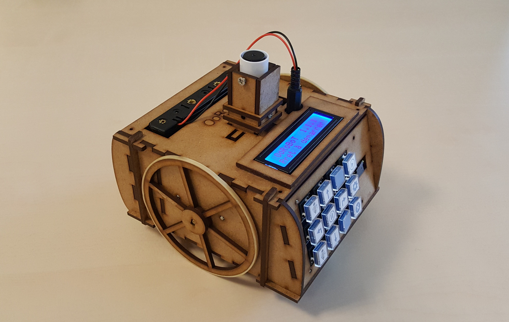

> Un robot éducatif OpenSource à construire soi-même

## Présentation du robot

Le FabLab de Lannion vend des kits pour construire son propre OoRoBoT pour 40€. Le kit contient 2 sacs :
  * Un contenant toutes les pièces nécessaires à contruire le châssis du robot en MDF
  * Un contenant tout le matériel électronique

La notice de montage est disponible [ici](https://orange-opensource.github.io/oorobot/montage.pdf).

L'OoRoBoT peut être utilisé de deux façons différentes :
  * Pour les enfants de 4 à 7 ans : programmer des parcours sur des plateaux (voir les plateaux disponibles [ici](https://github.com/Orange-OpenSource/oorobot/blob/master/doc/exercices))
  * Pour les enfants de 7 à 12 ans : réaliser des tracés avec un langage de programmation par blocs via une tablette Android ([programme disponible ici](https://orange-opensource.github.io/oorobot/apk/oorobot.apk) ). Vous pouvez vous entrainer à faire des tracés sur [cette page Web](https://orange-opensource.github.io/oorobot/blocks/index.html?code=B4U100R90E%23255000000%7CR45U150!U100r1c100a130r1c100a90) (reproduction de l'interface disponible dans l'application Android)

Le code (Arduino et application Android) est sous [GPL2](https://www.gnu.org/licenses/old-licenses/gpl-2.0.fr.html), les modèles 3D et la documentation sont sous [CC-BY-SA](https://creativecommons.org/licenses/by-sa/2.0/deed.fr).

## L'OoRoBoT dans la presse 

* [Ouest France du 12 septembre 2018](https://www.ouest-france.fr/bretagne/lannion-22300/lannion-oorobot-un-robot-educatif-pour-les-enfants-faire-soi-meme-5964440)
* [Le Télégramme du 12 septebmre 2018](https://www.letelegramme.fr/cotes-darmor/lannion/lannion-les-ecoles-equipees-de-36-robots-educatifs-12-09-2018-12076681.php)

## Pour aller plus loin

Le site web du projet est disponible [ici](https://orange-opensource.github.io/oorobot/).

Si vous voulez participer au projet n'hésitez pas à faire des "Pull Request" sur [GitHub](https://github.com/Orange-OpenSource/oorobot).

Vous pouvez suivre l'actualité autour d'OoRoBoT en suivant le mot-dièse associé sur [Twitter](https://twitter.com/hashtag/OoRoBoT?src=hash)

## Contact

Vous voulez commander un kit ou vous avez une question à propos du projet : contactez nous sur [oorobot@fablab-lannion.org](mailto:oorobot@fablab-lannion.org)
