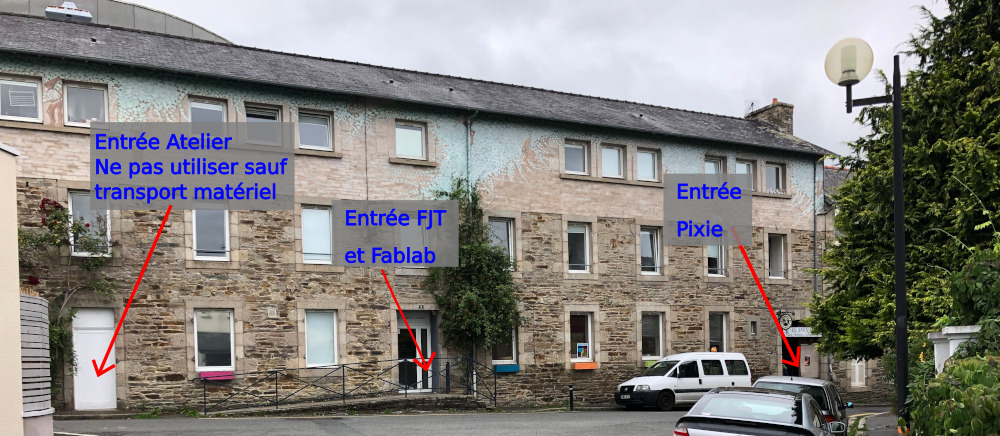

Contacts
============

<a href="mailto:{{ site.owner.email }}">
    
        <i class="fa fa-circle fa-stack-2x fa-inverse"></i>
        <i class="fa fa-envelope fa-stack-1x"></i>
    
</a>
<a href="http://twitter.com/{{ site.owner.twitter }}">
    
        <i class="fa fa-circle fa-stack-2x fa-inverse"></i>
        <i class="fa fa-twitter fa-stack-1x"></i>
    
</a>
<a href="http://github.com/{{ site.owner.github }}">
    
        <i class="fa fa-circle fa-stack-2x fa-inverse"></i>
        <i class="fa fa-github fa-stack-1x"></i>
    
</a>
<a href="http://facebook.com/{{ site.owner.facebook }}">
    
        <i class="fa fa-circle fa-stack-2x fa-inverse"></i>
        <i class="fa fa-facebook fa-stack-1x"></i>
    
</a>
<a href="http://mastodon.social/{{ site.owner.mastodon }}">
    
        <i class="fa fa-circle fa-stack-2x fa-inverse"></i>
        <i class="fa fa-facebook fa-stack-1x"></i>
    
</a>
Par mail à l'adresse: [contact@fablab-lannion.org](mailto:contact@fablab-lannion.org)
Vous pouvez aussi utiliser le [formulaire idoine](https://forum.fablab-lannion.org/memberlist.php?mode=contactadmin).

Newsletter
==========

Pour recevoir les infos du Fablab, qu'elles soient mensuelles, ou exceptionnelles, n'hésitez pas à vous inscrire sur notre newsletter:

    <iframe class="mj-w-res-iframe" scrolling="no" marginheight="0"
            src="https://app.mailjet.com/widget/iframe/5Mcd/HnB"
            marginwidth="0" padding="0" margin="0"
            style="background-color: transparent; box-shadow: none; padding: 0px; width: 900px;" width="900"
            frameborder="0"></iframe>
    

Horaires
============

Quel que soit votre niveau de compétence, que vous ayez un projet précis ou que vous soyez simplement curieux, vous êtes bienvenus lors de nos réunions et ateliers hebdomadaires :

* chaque mercredi de 18h00 à 23h00 : atelier ouvert
* chaque vendredi de 12h30 à 14h00 : réunion d'échange ouverte à tous 
* chaque vendredi de 12h30 à 20h30 : atelier ouvert
* chaque samedi   de 9h30 à 12h30 : atelier ouvert 
* A la demande, avec la présence d'un FabManager

Si ce n'est déjà fait, n'hésitez pas à vous inscrire sur le site, afin de recevoir les mises-à-jour sur les dates/heures des ateliers. Chacun peut venir avec son matériel, son projet, ses idées ou avec la simple envie d'apprendre...

Accès
=============

L'accès au fablab se fait par le 6 rue du 73ème territorial à Lannion, le Fablab est situé dans les locaux du foyer de jeunes travailleurs. (voir la carte). La porte devrait être ouverte jusqu'à 22H. Après cette heure, sonnez, le gardien devrait venir vous ouvrir. Sinon, tapez aux fenêtres de la pièce du rez-de-chaussée à l'angle de la rue (pièce arrondie, quelqu'un devrait venir vous ouvrir).
Ensuite, il y aura un fléchage, en attendant suivez le couloir sur la gauche jusqu'au bout pour trouver le Fablab.

<iframe width="100%" height="300px" frameborder="0" allowfullscreen src="//umap.openstreetmap.fr/fr/map/fablab-lannion-73emeterritorial_646993?scaleControl=false&miniMap=false&scrollWheelZoom=true&zoomControl=true&allowEdit=false&moreControl=true&searchControl=null&tilelayersControl=null&embedControl=null&datalayersControl=true&onLoadPanel=undefined&captionBar=false#18/48.72911/-3.46157"></iframe>
<a href="//umap.openstreetmap.fr/fr/map/fablab-lannion-73emeterritorial_646993">Voir en plein écran</a>

Tarifs 2025
=============

Vous pouvez retrouver ces tarifs sur le wiki du FabLab: [Tableau des tarifs d'utilisation des équipement](https://wiki.fablab-lannion.org/index.php?title=Tableau_des_tarifs_d%27utilisation_des_%C3%A9quipement).

## Machines de découpe			

|Prestation|Prix adhérents|Prix Extérieur|Détail|
|---------|---------|---------|---------|
|Découpe Laser|5,50 €|11,00 €|Le quart d'heure d'utilisation (*)|
|Découpe Plasma|5,50 €|11,00 €|Le quart d'heure d'utilisation (*)|
|Fraiseuse numérique|5,50 €|11,00 €|Le quart d'heure d'utilisation (*)|

> **Note:** 			
> Les matériaux doivent être fournis par l'utilisateur 
>  Se référer à un FabManager ou au Wiki pour connaître la liste des matériaux utilisables pour les différentes prestations	
> 
> (*) Toute période entamée est due			

## Textiles et Sérigraphie			

|Prestation|Prix adhérents|Prix Extérieur|Détail|
|---------|---------|---------|---------|
|Brodeuse numérique|2,20 €|4,40 €|Le quart d'heure d'utilisation hors stabilisateur (*)|
|Brodeuse numérique stabilisateur|1,00 €|2,00 €|Les 10cm de stabilisateur (facultatif)|
|Découpeuse vinyle|1,50 €|3,00 €|Le forfait pour une découpe hors coût de la matière|
|Découpe vinyle autocollant|6,50 €|13,00 €|Le mètre de feuille vinyle|
|Découpe vinyle Flex (flocage textile)|5,50 €|11,00 €|les 50cm de feuille flex|
|Impression photo format A2|7,00 €|14,00 €|La feuille|
|Impression photo format A3|4,50 €|9,00 €|La feuille|
|Impression photo format A4|2,50 €|5,00 €|La feuille|
|Impression photo format A5|1,50 €|3,00 €|La feuille|

> **Notes:**
>	
> * Une presse à chaud est à disposition pour le flocage textile.
> * Impression Photos: le papier (glossy ou semi glossy) est fourni
> 
>(*) Toute période entamée est due			

## Création 3D

|Prestation|Prix adhérents|Prix Extérieur|Détail|
|---------|---------|---------|---------|
|Impression 3D filament|1,20 €|2,40 €|Forfait pour une impression hors coût de la matière|
|Impression 3D résine|1,50 €|3,00 €|Forfait pour une impression hors coût de la matière|
|Filament (ABS/PLA)|0,12 €|0,24 €|Le gramme de matière|
|Résine|0,20 €|0,40 €|Le gramme de matière|
|Thermoformage|1,00 €|2,00 €|La feuille de 0.5mm d'épaisseur|
|Thermoformage|4,00 €|8,00 €|La feuille de 1,5mm d'épaisseur|
|Thermoformage|4,00 €|8,00 €|La feuille de PETG certifié contact alimentaire de 1mm d'épaisseur|

> **Note:**
> Lors d'une impression, le tarif final se calcule en additionnant le coût de l'impression forfaitaire avec la quantité de matière utilisée (la pièce est pesée à la suite de l'impression)			
			
## Adhésion			

|Type|Prix|Détail|
|---------|---------|---------|
|Adhésion plein tarif|35,00 €|Adhésion a l'année civile|
|Adhésion tarif social|10,00 €|Adhésion a l'année civile sur présentation de pièces justificative|
|Adhésion personne morale|35,00 €|Adhésion à l'année civile|
	
## Vente d'objets			

|Produit|Prix|Détail|
|---------|---------|---------|
|[OORobot en kit](/oorobot)|45,00 €|Le OORobot est à monter par l'utilisateur|
|[Ecran 15/17" occasion](https://wiki.fablab-lannion.org/index.php?title=Reconditionnement_des_Ordinateurs)|20,00 €|Sous réserve de disponibilité|
|[Ecran 19/22" occasion](https://wiki.fablab-lannion.org/index.php?title=Reconditionnement_des_Ordinateurs)|30,00 €|Sous réserve de disponibilité|
|[PC portable reconditionné](https://wiki.fablab-lannion.org/index.php?title=Reconditionnement_des_Ordinateurs)|entre 60€ et 100€|Sous réserve de disponibilité|
|[PC de bureau reconditionné](https://wiki.fablab-lannion.org/index.php?title=Reconditionnement_des_Ordinateurs)|40,00 €|Sous réserve de disponibilité|
		
## Services			

|Prestation|Prix|Détail|
|---------|---------|---------|
|Location de borne d'arcade|25,00 €|Location à la semaine|
|Montage de [OORobot](/oorobot)|40,00 €||
