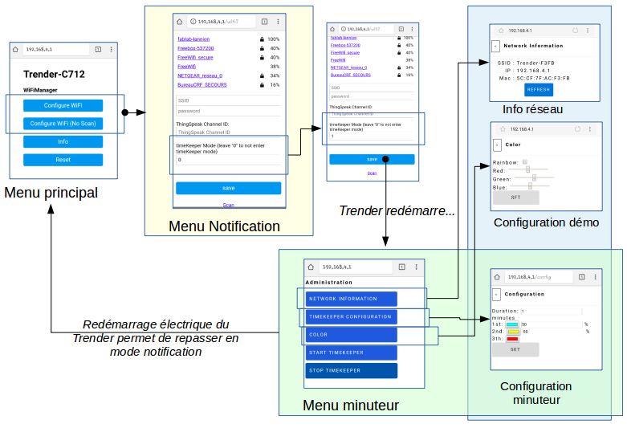
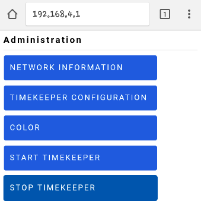
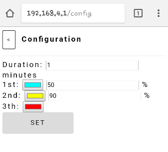
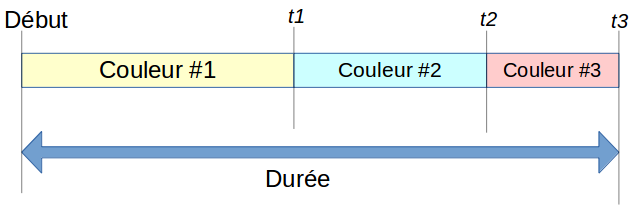
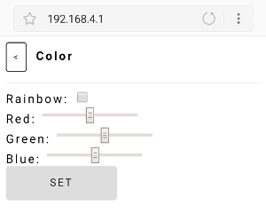
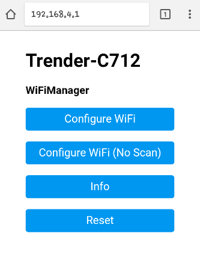
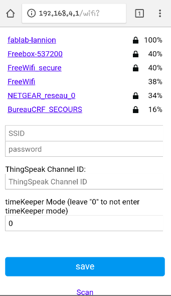

> "C'est au cours de nos moments les plus sombres que nous devons nous concentrer pour voir la lumière.." Aristote Onassis

Le Trender est un objet qui transforme des informations en lumière.

*Lire ceci dans une autre langue: [English](/trender)*

## Table des matières
  - [Modes](#modes)
    - [Minuteur](#minuteur)
    - [Démo](#démo)
    - [Notification](#notification)
  - [Q&A](#q&a)

Connectez le Trender à une source d'alimentation via le câble USB, une lumière doit apparaître à la mise sous tension de l'appareil.

## Modes

Le Trender supporte plusieurs modes:
 * Démo
 * Minuteur
 * Système de notification  (twitter, jenkins,...)

Par défault le Trender est initialisé en mode Notification.

Vous pouvez passer du mode Notification à Minuteur en entrant *1* dans le champ mode
du menu **Configure WiFi**. Une lumière verte indiquera que le changement a
été pris en compte.

Une fois en mode Minuteur, vous pouvez revenir en mode Notification en redémarrant électriquement le Trender.

### Minuteur

Un minuteur permet de mieux gérer son temps. Le Trender permet la
personnalisation de 3 seuils.

Depuis le menu "WiFi configure" menu, une fois le mode changé, revenez sur la
page principale (http://192.168.4.1).

Vous pouvez alors:
  * Personnaliser votre Minuteur
  * Démarrer votre Minuteur
  * Arrêter votre Minuteur
  * Obtenir des informations réseaux du trender
  * Démarrer le mode démo

Sélectionnez le menu **TIMEKEEPER CONFIGURATION**

#### Configuration

Vous pouvez personnaliser:
 * une durée totale
 * 3 étapes intermédiaires

La durée et les étapes peuvent être définies comme suit:

### Démo

Le mode Démo peut être démarré depuis le menu Minuteur.
Sélectionnez le sous menu **Color** puis sélectionner  **rainbow** (jeu de
lumières aléatoires) ou choisissez votre couleur favorite via le sélecteur.

### Notification

Le Trender peut transformer des notifications en lumière.
Vous devez configurer le point d'accès et le channel ThingSpeak https://thingspeak.com/.

La procédure pour démarrer votre trender est:
  * Depuis votre téléphone ou votre ordinateur, sélectionner le réseau WiFI dont le SSID commence par TRENDER-
  * Si aucune fenêtre n'apparaît, ouvrez un navigateur Internet et tapez http://192.168.4.1

Vous devriez voir l'écran suivant:

 1. Configure WiFi
 2. Configure WiFi (No Scan)
 3. Info
 4. Reset

#### Configure WiFi

Le menu "Configure WiFi" permet de connecter le Trender à Internet via une passerelle (boxe Internet, Téléphone, ..) ainsi que le channel ThingSpeak de notification.

Le Trender se reconnectera automatiquement à un point d'accès déjà configuré
si il a été configuré précédemment et si le réseau est disponible.
Il est possible depuis ce menu de lister tous les réseaux WiFi disponibles.

TODO config ThinkSpeak

#### Configure WiFi (No Scan)

Le menu "Configure WiFi (No scan)" permet de configurer le mode notification et plus précisément le channel ThingSpeak.

#### Info

Ce menu fournit des informations sur le Trender (Chip ID, Adresse IP, MAC, ...).

#### Reset

Ce menu permet de reconfigurer le Trender dans son état initial.
**Attention tous les paramètres de configuration seront effacés!**

Les paramètres de connexion WiFI sont notamment effacés.

## Q&A

Q: Où est le code?
A: https://github.com/FablabLannion/Trender

Q: Une autre référence?
A: Une page wiki (en Français) est disponible http://wiki.fablab-lannion.org/index.php?title=Trender

Q: Qui contacter?
A: par mail trender@fablab-lannion.org, ou sur twitter.com/fablablannion
